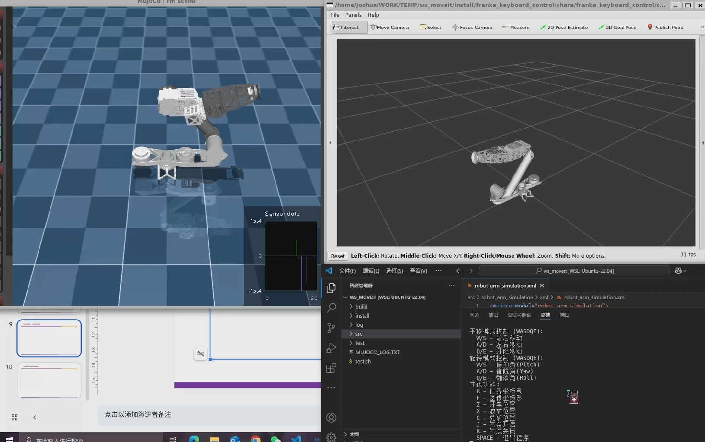

# AIR6021-Team13-FinalProject
This is the final project for team13 in AIR6021/AIR5021 (CUHKsz).

## 📖 Getting Started

### Dependencies
#### Environment
```
OS: ubuntu 22.04 x86_64
Programming Language: Python 3.10.12
```
Follow the following instructions: 

1. Install ROS2 Humble & install requirements

    ```
    wget http://fishros.com/install -O fishros && . fishros
    pip install -r requirements.txt
    ```

2. Install control algorithm & simualtion

    ```
    git clone https://github.com/120090162/AIR6021-Team13-FinalProject.git
    cd AIR6021-Team13-FinalProject/src
    colcon build --symlink-install --cmake-args -DCMAKE_BUILD_TYPE=Release --parallel-workers 10
    ```

## 🕹️ Play!
**Each time you open a new terminal, you need to execute `source ~/.bashrc` .**
* Simulation

    ```
    ros2 launch franka_keyboard_control bringup.launch.py
    # new terminal
    ros2 run franka_keyboard_control rm_servo_keyboard_input
    ```
    If you successfully run the command, you will see:
    <p align="center">
    
    </p>

* Deploy to real robot

    ```
    # enable serial port communication permissions
    sudo chmod 777 ./src/script/create_udev_rules.sh
    ./src/script/create_udev_rules.sh
    # enable automatic program start
    cd ./src/src/rm_upstart
    sudo chmod +x ./register_service.sh
    sudo ./register_service.sh

    # if success, will have the following outputs:
    # Creating systemd service file at /etc/systemd/system/rm.service...
    # Reloading systemd daemon...
    # Enabling service rm.service...
    # Starting service rm.service...
    # Service rm.service has been registered and started.
    ```